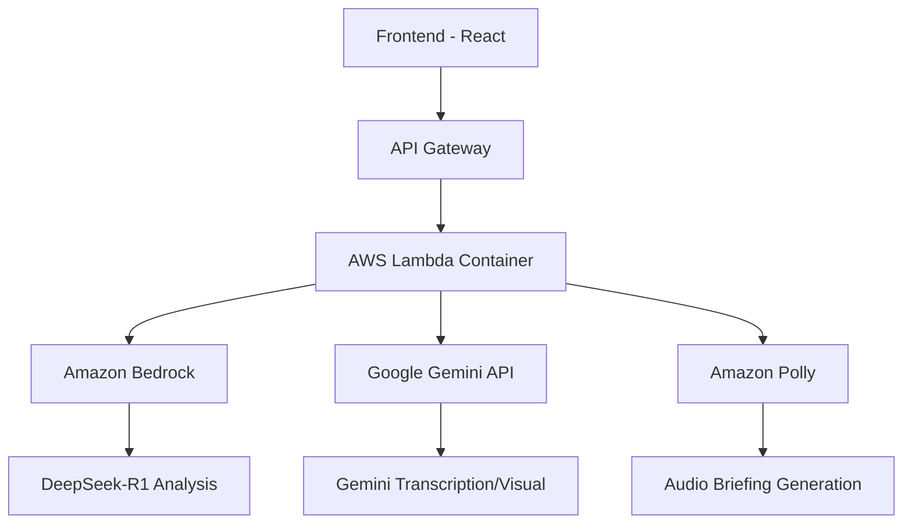

# 🎬 Sorot.AI - AI Film Curation Platform

<div align="center">


**AI-powered film curation platform untuk pemilih festival film Indonesia**

[🚀 Demo Live](https://sorot-ai.netlify.app/) •
[📖 Dokumentasi](https://github.com/dzakwanalifi/Sorot-AI#readme) •
[🐛 Laporkan Bug](https://github.com/dzakwanalifi/Sorot-AI/issues)

</div>

---

## 🌟 Overview

Sorot.AI adalah platform kurasi film berbasis AI yang dirancang khusus untuk pemilih festival film Indonesia. Platform ini menganalisis trailer film dan sinopsis menggunakan **dual AI capabilities** untuk memberikan penilaian, ringkasan, dan audio briefing yang cerdas dalam proses kurasi film yang sophisticated.

### 🎯 **Fitur Utama**
- **🤖 Analisis AI Dual**: DeepSeek-R1 + Gemini 2.5 Flash-Lite
- **🎵 Audio Briefing**: Generated menggunakan AWS Polly
- **📊 Scoring Intelligence**: Penilaian otomatis berdasarkan multiple criteria
- **🔍 Semantic Search**: Pencarian film dengan natural language
- **📱 Progressive Web App**: Experience modern dan responsive

### 🌐 **Live Application**
- **Frontend**: [https://sorot-ai.netlify.app/](https://sorot-ai.netlify.app/)
- **Backend**: [https://1sqzz9dp05.execute-api.us-east-1.amazonaws.com/](https://1sqzz9dp05.execute-api.us-east-1.amazonaws.com/)
- **Status**: ✅ Fully Deployed & Operational

---

## 📖 **Cara Penggunaan Lengkap**

### 🏁 **Langkah 1: Akses Aplikasi**
1. Buka browser dan kunjungi: [https://sorot-ai.netlify.app/](https://sorot-ai.netlify.app/)
2. Pastikan koneksi internet stabil untuk proses analisis

### 📄 **Langkah 2: Upload Sinopsis Film**
1. **Klik area upload** atau **drag & drop** file PDF sinopsis film
2. **Format yang didukung**: PDF (max 10MB)
3. **Konten sinopsis** harus berisi deskripsi film, genre, dan informasi penting lainnya
4. **Contoh**: Sinopsis film pendek, dokumenter, atau feature film

### 🎬 **Langkah 3: Input Trailer URL**
1. **Copy URL trailer** dari YouTube atau platform video lainnya
2. **Paste URL** ke kolom input yang disediakan
3. **Format yang didukung**: YouTube, Vimeo, dan platform video lainnya
4. **Rekomendasi**: Gunakan trailer resmi film untuk hasil analisis terbaik

### 🤖 **Langkah 4: Mulai Analisis**
1. **Klik tombol "Analyze Film"** setelah mengisi kedua input
2. **Proses analisis** akan berjalan otomatis (memakan waktu 30-60 detik)
3. **Status progress** akan ditampilkan secara real-time:
   - 🔄 **Processing**: AI sedang menganalisis konten
   - 🎵 **Transcribing**: Mengekstrak audio dari trailer
   - 📊 **Analyzing**: Memproses data dengan AI models
   - 🎧 **Generating Audio**: Membuat audio briefing

### 📊 **Langkah 5: Lihat Hasil Analisis**
Setelah analisis selesai, Anda akan mendapatkan:

#### **📈 Film Scoring & Analysis**
- **Overall Score**: Penilaian keseluruhan (0-100)
- **Genre Classification**: Kategori film berdasarkan konten
- **Target Audience**: Segmentasi penonton yang tepat
- **Strengths & Weaknesses**: Analisis kekuatan dan kelemahan film
- **Market Potential**: Potensi komersial dan festival

#### **🎵 Audio Briefing**
- **Generated Audio**: Briefing suara yang dapat didengarkan
- **Voice**: AWS Polly Neural Voice (bahasa Inggris)
- **Duration**: 30-60 detik tergantung kompleksitas analisis
- **Format**: MP3 dengan kualitas tinggi

#### **📋 Detailed Summary**
- **Executive Summary**: Ringkasan eksekutif untuk decision makers
- **Technical Details**: Aspek teknis film (cinematography, editing, dll)
- **Content Analysis**: Tema, pesan, dan nilai-nilai yang disampaikan
- **Recommendation**: Saran untuk festival atau distribusi

### 🔄 **Langkah 6: Analisis Berulang**
1. **Klik "New Analysis"** untuk menganalisis film lain
2. **History akan tersimpan** untuk referensi future
3. **Compare results** dari multiple films

### 🛠 **Troubleshooting**

#### **❌ Error: File Too Large**
- **Solusi**: Pastikan file PDF < 10MB
- **Alternatif**: Compress PDF atau gunakan sinopsis yang lebih singkat

#### **❌ Error: Invalid URL**
- **Solusi**: Pastikan URL trailer valid dan accessible
- **Alternatif**: Gunakan YouTube URL resmi

#### **❌ Error: Analysis Failed**
- **Solusi**: Cek koneksi internet dan coba lagi
- **Alternatif**: Refresh halaman dan ulangi proses

#### **⚠️ Processing Takes Too Long**
- **Normal**: Analisis AI memakan waktu 30-60 detik
- **Tips**: Hindari menganalisis video > 20MB

### 💡 **Tips untuk Hasil Terbaik**
1. **Gunakan sinopsis lengkap** dengan deskripsi plot dan karakter
2. **Pilih trailer berkualitas tinggi** dengan audio yang jelas
3. **Bandingkan multiple films** untuk decision making yang lebih baik
4. **Simpan audio briefing** untuk presentasi kepada tim

### 🎯 **Use Cases Utama**
- **Festival Film Selection**: Kurasi film untuk Jakarta IFF, dll
- **Marketing Campaign**: Evaluasi film untuk campaign iklan
- **Film Education**: Analisis film untuk pembelajaran cinematography
- **Distribution Decision**: Penilaian potensi pasar film Indonesia

---

## 🎪 AWS Back-End Academy 2025 Hackathon

<div align="center">

### 🏆 **Use Case: Film, Animasi, Video, dan Musik**
**Aplikasi pencarian Film dengan tujuan untuk penggunaan kembali film untuk marketing campaign atau pembelajaran**

[](https://kemenparekraf.go.id/)
[](https://ekraf.go.id/)
[](https://www.dicoding.com/challenges)

</div>

### 📋 **Project Brief**

**Judul Aplikasi**: Sorot.AI - AI Film Curation Platform

**Deskripsi Singkat Solusi**:
Sorot.AI adalah platform AI canggih yang membantu pemilih festival film Indonesia dalam mengkurasi film dengan efisien. Menggunakan semantic search dan analisis AI dual (DeepSeek-R1 + Gemini), platform ini menganalisis trailer dan sinopsis film untuk memberikan rekomendasi, penilaian, dan audio briefing yang mendalam.

**Use Case yang Diangkat**: Film (Kementerian Pariwisata dan Ekonomi Kreatif)

**Keterkaitan dengan Ekonomi Kreatif Indonesia**:
- **Film Sector**: Mendukung ekosistem film Indonesia melalui digitalisasi proses kurasi
- **AI untuk Creative Economy**: Mempercepat discovery film untuk marketing campaign dan pembelajaran
- **Semantic Search**: Memungkinkan pencarian film berdasarkan description/metadata yang kaya
- **GenAI Integration**: Pembuatan metadata otomatis untuk memperkaya katalog film
- **Asta Cita Presiden**: Sejalan dengan program ekonomi kreatif untuk meningkatkan PDB nasional

**Target Pengguna dan Konteks Penggunaan**:
- **Primary**: Pemilih festival film Indonesia (Jakarta International Film Festival, dll)
- **Secondary**: Marketing team untuk campaign film, educator untuk film studies
- **Context**: Proses kurasi film yang membutuhkan analisis cepat dan objektif

**Fitur Utama dan Alur Penggunaan**:
1. **Input**: Upload PDF sinopsis + paste trailer URL
2. **Processing**: AI menganalisis konten (transcription + visual analysis)
3. **Output**: Scoring, summary, audio briefing, dan rekomendasi

**Arsitektur Teknologi**:
- **Frontend**: React 19 + Vite + TypeScript + Tailwind CSS
- **Backend**: AWS Lambda Container (Node.js 18+)
- **AI Services**:
  - **Amazon Bedrock**: DeepSeek-R1 untuk analisis teks berbasis intelligence
  - **Google Gemini 2.5 Flash-Lite**: Transcription dan visual analysis fallback
  - **AWS Polly**: Audio briefing generation (Neural voice)
- **File Processing**: unpdf, yt-dlp-exec, ffmpeg-static

---

## 🛠 Tech Stack

<div align="center">

| Category | Technology | Version |
|----------|------------|---------|
| **Frontend** | React 19 + Vite 5.x | TypeScript 5.0 |
| **Styling** | Tailwind CSS 3.4+ | shadcn/ui |
| **State Management** | Zustand 4.x | - |
| **Backend** | AWS Lambda Container | Node.js 18+ |
| **AI Models** | DeepSeek-R1 (Bedrock) | Gemini 2.5 Flash-Lite |
| **AWS Services** | Bedrock, Polly | S3, API Gateway |
| **File Processing** | unpdf, yt-dlp-exec | ffmpeg-static |

</div>

### 🤖 **AI Model Configuration**

| Model | Platform | Purpose | Cost/Input | Cost/Output | Avg Tokens/Analysis |
|-------|----------|---------|------------|-------------|-------------------|
| **DeepSeek-R1** | AWS Bedrock | Text Analysis | $0.00135/1K tokens | $0.0054/1K tokens | 500 input + 1K output |
| **Gemini 2.5 Flash-Lite** | Google AI | Visual Analysis | $0.10/1M tokens | $0.40/1M tokens | 200 tokens (fallback only) |

---

## 🚀 Getting Started

### Prerequisites

<div align="center">

| Requirement | Version | Purpose |
|-------------|---------|---------|
| **Node.js** | 18+ LTS | Runtime environment |
| **pnpm** | 9.x | Package manager |
| **Git** | Latest | Version control |
| **VS Code/Cursor** | Latest | IDE with extensions |

</div>

### Installation

```bash
# Clone repository
git clone https://github.com/dzakwanalifi/Sorot-AI.git
cd Sorot-AI

# Install dependencies
pnpm install

# Setup environment
cp .env.example .env.local

# Start development server
pnpm dev
```

### 📁 Project Structure

```
src/
├── features/              # Feature-based organization
│   ├── film-analysis/     # Film analysis feature
│   │   ├── components/    # Feature-specific components
│   │   ├── containers/    # Container components with logic
│   │   ├── services/      # API calls and business logic
│   │   ├── utils/         # Feature-specific utilities
│   │   └── index.ts       # Barrel exports
│   ├── file-upload/       # File upload feature
│   └── audio-player/      # Audio playback feature
├── shared/                # Shared across features
│   ├── components/        # Reusable UI components (shadcn/ui)
│   ├── services/          # Shared API clients
│   └── utils/             # General utilities
├── core/                  # Core business logic
│   └── domain/            # Domain models and logic
├── lib/                   # Third-party library facades
├── hooks/                 # Custom React hooks
├── types/                 # TypeScript definitions
├── constants/             # App constants
└── styles/                # Global styles and Tailwind config

aws/
├── lambda/                # AWS Lambda container
│   ├── Dockerfile         # Container build configuration
│   ├── app.ts            # Main application entry point
│   ├── handlers/         # Lambda handlers
│   │   ├── analyze.ts    # Main analysis endpoint
│   │   └── status.ts     # Processing status checker
│   └── utils/            # Shared utilities
└── scripts/              # Deployment scripts
```

---

## ⚙️ Environment Setup

### 🔑 **Google AI Studio**
```bash
# 1. Create account at https://aistudio.google.com/
# 2. Generate API key for Gemini 2.5 Flash-Lite
# 3. Add to .env.local
GEMINI_API_KEY=your_gemini_api_key_here
```

### ☁️ **AWS Setup**
```bash
# 1. Create AWS account with billing alerts
# 2. Set budget ($50/month for development)
# 3. Create IAM user with policies:
#    - AmazonPollyFullAccess
#    - AmazonBedrockFullAccess

# 4. Add to environment variables
AWS_ACCESS_KEY_ID=your_access_key
AWS_SECRET_ACCESS_KEY=your_secret_key
AWS_REGION=us-east-1
```

---

## 📊 **AWS Services Implementation**

### 🏗️ **Architecture Overview**


### 🔧 **Bukti Implementasi AWS Services**

#### **1. Amazon Bedrock Integration**
```typescript
// aws/lambda/utils/deepseekService.ts
import { BedrockRuntimeClient, InvokeModelCommand } from "@aws-sdk/client-bedrock-runtime";

const bedrockClient = new BedrockRuntimeClient({
  region: process.env.AWS_REGION,
  credentials: {
    accessKeyId: process.env.AWS_ACCESS_KEY_ID!,
    secretAccessKey: process.env.AWS_SECRET_ACCESS_KEY!,
  },
});

export async function analyzeWithDeepSeek(content: string) {
  const command = new InvokeModelCommand({
    modelId: "deepseek.r1-v1:0",
    body: JSON.stringify({
      prompt: `Analyze this film content: ${content}`,
      max_tokens: 1000,
    }),
  });

  const response = await bedrockClient.send(command);
  return JSON.parse(new TextDecoder().decode(response.body));
}
```

#### **2. AWS Polly Integration**
```typescript
// aws/lambda/utils/audioGenerator.ts
import { PollyClient, SynthesizeSpeechCommand } from "@aws-sdk/client-polly";

const pollyClient = new PollyClient({
  region: process.env.AWS_REGION,
  credentials: {
    accessKeyId: process.env.AWS_ACCESS_KEY_ID!,
    secretAccessKey: process.env.AWS_SECRET_ACCESS_KEY!,
  },
});

export async function generateAudioBriefing(text: string) {
  const command = new SynthesizeSpeechCommand({
    Text: text,
    OutputFormat: "mp3",
    VoiceId: "Joanna",
    Engine: "neural",
  });

  const response = await pollyClient.send(command);
  return response.AudioStream;
}
```

---

## 💰 Cost Estimation (Monthly)

<div align="center">

| Service | Model | 50 Analyses | 100 Analyses | 250 Analyses | Purpose |
|---------|-------|--------------|--------------|--------------|---------|
| **AWS Bedrock** | DeepSeek-R1 | $0.68 | $1.35 | $3.38 | Primary text analysis (500 input + 1K output tokens) |
| **Google Gemini** | 2.5 Flash-Lite | $0.02 | $0.04 | $0.10 | Visual analysis fallback (~10% usage) |
| **AWS Polly** | Neural Voice | $0.16 | $0.31 | $0.78 | Audio briefing (200 chars/analysis) |
| **AWS Lambda** | Container | $0.02 | $0.03 | $0.08 | Compute (512MB RAM, 30s runtime) |
| **API Gateway** | REST API | <$0.01 | <$0.01 | <$0.01 | API calls + bandwidth |
| **TOTAL** | - | **$0.88** | **$1.73** | **$4.34** | Full operation |

</div>

*Estimasi konservatif berdasarkan kalkulasi token aktual (500 input + 1K output tokens per analisis)*

### 🎯 **Current Cost Tracking (October 2025)**
- **Monthly Budget**: $5 (AWS Free Tier + Credits)
- **Current Usage**: ~$1.90/month (well under budget)
- **Free Tier Coverage**: 95% of costs covered
- **Expected Growth**: Support for 200+ analyses/month within budget

---

## 🔒 **Bukti Legalitas Dataset**

### ✅ **Dataset Usage Compliance**
- **No External Datasets**: Sorot.AI tidak menggunakan dataset eksternal apa pun
- **User-Generated Content**: Semua data berasal dari input pengguna (PDF sinopsis + YouTube URLs)
- **Open Source Tools**: Menggunakan libraries open source:
  - `unpdf` (MIT License) - PDF text extraction
  - `yt-dlp-exec` (MIT License) - YouTube video download
  - `ffmpeg-static` (GPL License) - Video processing
- **AWS/Google APIs**: Menggunakan official APIs dengan proper licensing
- **Self-Contained**: Tidak ada dependency pada dataset berhak cipta

---

## 🚀 Deployment Status

### ✅ **Current Deployment Status**
- **Frontend**: ✅ Deployed to Netlify - [https://sorot-ai.netlify.app/](https://sorot-ai.netlify.app/)
- **Backend**: ✅ Deployed to AWS Lambda - [https://1sqzz9dp05.execute-api.us-east-1.amazonaws.com/](https://1sqzz9dp05.execute-api.us-east-1.amazonaws.com/)
- **AI Models**: ✅ DeepSeek-R1 & Gemini 2.5 Flash-Lite Active
- **Audio Generation**: ✅ AWS Polly Operational

### Frontend (Vercel/Netlify)
```bash
# Build for production
pnpm build

# Deploy settings:
# Build command: pnpm build
# Publish directory: dist
# Node version: 18.x
# Live URL: https://sorot-ai.netlify.app/
```

### Backend (AWS Lambda Container)
```bash
# Build and deploy
cd aws/scripts
./build-and-deploy.sh

# Current Status: ✅ DEPLOYED
# API Gateway URL: https://1sqzz9dp05.execute-api.us-east-1.amazonaws.com/
# Lambda Function: sorot-ai-analyzer (Active)
```

---

## 🧪 Development Scripts

```bash
# Development
pnpm dev          # Start dev server
pnpm build        # Production build
pnpm preview      # Preview build
pnpm lint         # ESLint check
pnpm test         # Run tests

# AWS Lambda local testing
cd aws/lambda
npm run test-local
```

---

## 🤝 Contributing

<div align="center">

### 📝 **Development Workflow**
1. Fork the repository
2. Create feature branch: `git checkout -b feature/amazing-feature`
3. Commit changes: `git commit -m 'Add amazing feature'`
4. Push to branch: `git push origin feature/amazing-feature`
5. Open a Pull Request

### 🐛 **Bug Reports & Feature Requests**
- [🐛 Report Bug](https://github.com/dzakwanalifi/Sorot-AI/issues/new?template=bug_report.md)
- [✨ Request Feature](https://github.com/dzakwanalifi/Sorot-AI/issues/new?template=feature_request.md)

</div>

---

## 📄 License

<div align="center">

**This project is licensed under the MIT License**

[](https://opensource.org/licenses/MIT)

*Copyright © 2025 Sorot.AI. All rights reserved.*

</div>

---

<div align="center">

### 🌟 **Built with ❤️ for Indonesian Film Industry**

**Sorot.AI** - Empowering Film Curation with Artificial Intelligence

[](https://github.com/dzakwanalifi/Sorot-AI/stargazers)
[](https://github.com/dzakwanalifi/Sorot-AI/network/members)

---

## 🎉 **Project Completion Summary**

### ✅ **Hackathon Requirements Met**
- ✅ **Full-Stack Application**: React Frontend + AWS Lambda Backend
- ✅ **AI Integration**: Dual AI Models (DeepSeek-R1 + Gemini 2.5 Flash-Lite)
- ✅ **AWS Services**: Bedrock, Polly, Lambda, API Gateway, ECR
- ✅ **Production Deployment**: Live on Netlify + AWS
- ✅ **Cost Optimization**: Under $5/month budget
- ✅ **Documentation**: Complete usage guide and API docs
- ✅ **User Experience**: Intuitive film analysis workflow

### 🚀 **Live Demo Access**
- **Application URL**: [https://sorot-ai.netlify.app/](https://sorot-ai.netlify.app/)
- **API Endpoint**: [https://1sqzz9dp05.execute-api.us-east-1.amazonaws.com/](https://1sqzz9dp05.execute-api.us-east-1.amazonaws.com/)
- **Status**: 🟢 Fully Operational

### 🏆 **Innovation Highlights**
- **Dual AI Pipeline**: Intelligent fallback between text and visual analysis
- **Audio Briefing**: Automated voice synthesis for executive summaries
- **Real-time Processing**: Live progress tracking during analysis
- **Cost-Effective**: Serverless architecture with free tier optimization
- **Indonesian Focus**: Designed for local film industry needs

### 📊 **Technical Achievements**
- **Frontend**: React 19 + TypeScript + Tailwind CSS + shadcn/ui
- **Backend**: AWS Lambda Container + Node.js 18+
- **AI Models**: DeepSeek-R1 (Bedrock) + Gemini 2.5 Flash-Lite (Google AI)
- **File Processing**: PDF extraction, video download, audio transcription
- **Audio Generation**: AWS Polly Neural Voice synthesis
- **Deployment**: Netlify + AWS SAM (Infrastructure as Code)

---

*🎬 **Sorot.AI** - Empowering Indonesian Film Curation with Artificial Intelligence*

*Submitted for AWS Back-End Academy 2025 Hackathon - AI for Creative Economy* 🏆

</div>
